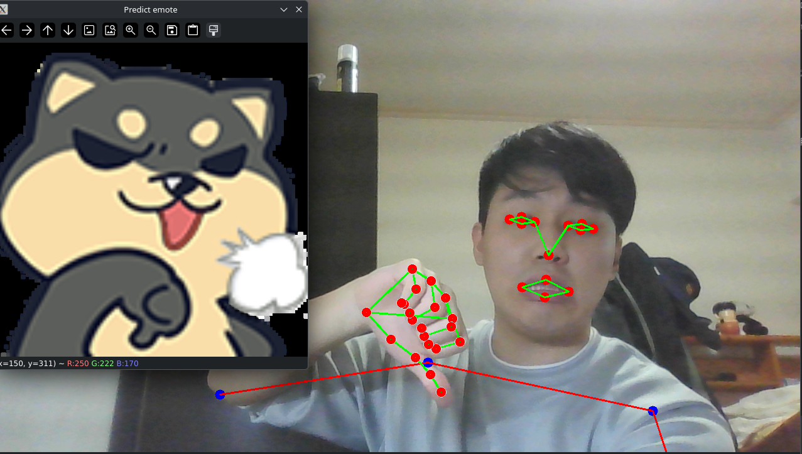
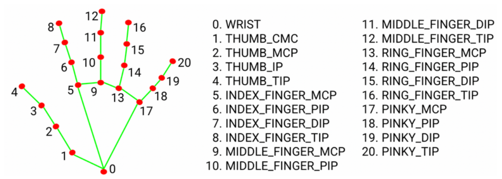
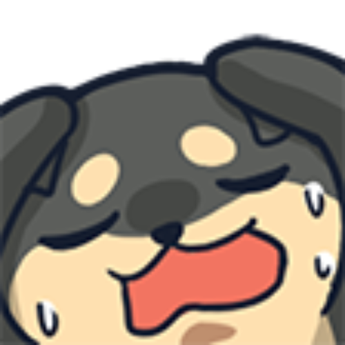
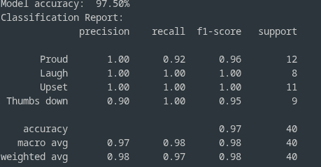

# Emote Detection: DingDing248 Emoji Detector
An emote detector that use webcam to capture the user's gestures, facial and body movement to find the most fit emote in the images file.

## Overview
Inspired by [clash-royale-emote-detector](https://github.com/jasonli5/clash-royale-emote-detector/blob/main/README.md) this repo, i also want to bulid something like that. So i choose one of my favorite streamer on twitch [dingding248](https://www.twitch.tv/dingding248)'s emotes for this project. Based on the features of teh choosen emotes, i try not to find too similar emotes for this try, and the final results turn out quite great.
<p align="center">
    
</p>

## Features
### Landmarks detection
Use Google Research developing package - Mediapipe to detect the landmarks, the model i use is **holistic model**. It not only detect the facial landmarks but also pose landmarks.
<p align="center">
    
    
</p>
<p align="center">
    <em>Figure 1. finger's landmarks index. Figure 2. Pose's landmarks index 
</p>
Based on the features of the identified emotes, i choose some landmarks to display and to be input data.

* Facial indices: 1(nose tip), 33, 133, 159, 145(Left eye), 362, 263, 386, 374(Right eye),61, 291, 11, 16(Mouth).
* Pose indices: 11, 12(shoulders), 13, 14(elbows).
* Hand indices: All 21 indices (For one hand), both hands are 42 indices.

### ML model
I choose **Random Forest** as the model of this classification project. Because random forest have high accuracy and can reduce overfitting by averaging multiple decision trees, making it robust to noise and outliers.

## Installation
Use poetry + pyproject.toml to construct the virtual environment.

* Check if install pyenv and poetry.
``` sh
make check-tools
```
* Check if python3.10 exists, and use this version's python in virtual environment. 
```sh
make setup
```
* Install the packages.
``` sh
make init
```
* Clean all the cache.
``` sh
make purge
```
* Delete the whole virtual environment.
```sh
make clean
```
## Project structure

```
ding-emotes-detector/
├── src/
|   ├── holistic_detector.py # Detect landmarks
|   ├── preprocessor.py # Preprocess landmarks data for ML model
|   ├── pose_classify_model.py # Random forest model init
|   ├── data_collector.py # Collect the trainging data
|   └──main.py # Main UI
|── data/
|── images/
|── models/
|── Makefile
└── pyproject.toml
```
## Usage
### Quick start
Run the detector with pre-trained model.
``` sh
poetry run python main.py
```
#### Controls
* **'q'** : Quit the application.
* **'s'** : Screen shoot the detector frame. 

### Data collection
To collect data for your own training.
```sh
poetry run python data_collector.py
```
#### Controls
* **'q'** : Quit the OpenCV windows.
* **'1'~'4'** : Collect the pose 1 ~ 4's data.
* **'a'** : Auto collect the data every 5 frames.
* **'s'** : Save the collected data in /data.
* **'l'** : Load the data from /data.
* **'t'** : Use training data to train random forest model and save the model in /models.

## Pose classes
The model can classify following poses:
| Emote | Description | Reference |
|-------|-------------|-----------|
|Proud  |Cross arms in front of chest |  |
|Laugh  | Laughing with one hand in front of mouth | |
|Upset  | Both hands on the top of head and feeling regret |  |
|Thumb down| One hand thumb is down | |

## Model Accuracy

<p align="center">
    

## Future Work
* Enable more emotes for the classification.
* Use different machine learning model for higher accuracy.